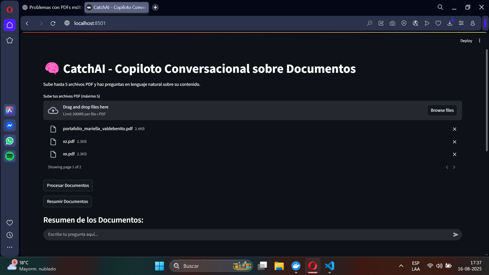
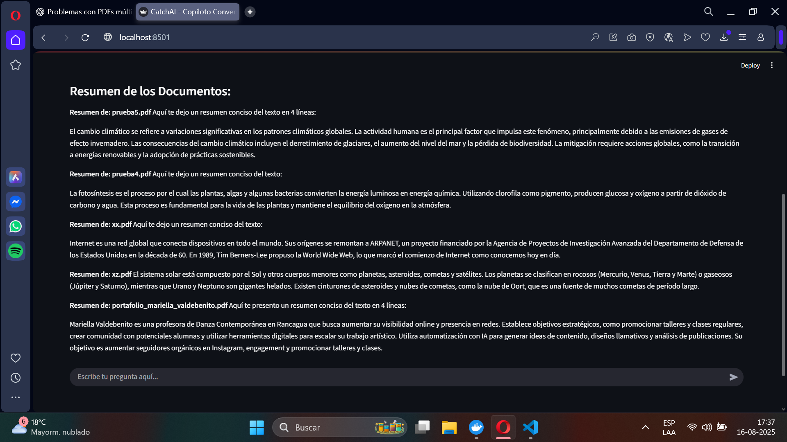
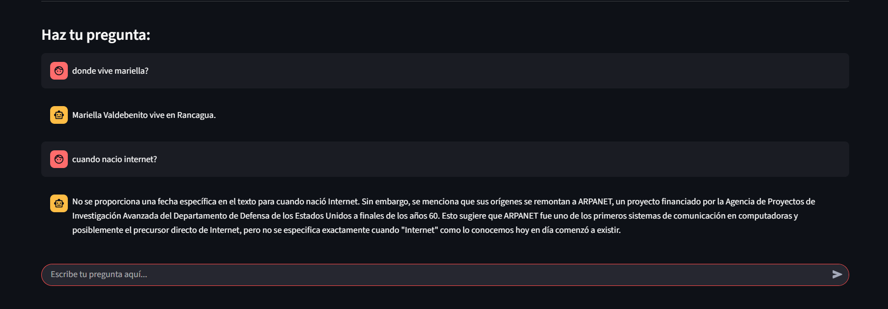

# CatchAI – Copiloto Conversacional sobre Documentos.

Este proyecto implementa un copiloto conversacional que permite a los usuarios subir hasta 5 archivos PDF y hacer preguntas en lenguaje natural sobre su contenido. La aplicación utiliza técnicas de Recuperación Aumentada por Generación (RAG) para proporcionar respuestas contextuales basadas en los documentos proporcionados.

## 🚀 Cómo Levantar el Entorno

### Prerrequisitos

Antes de continuar, asegúrate de tener instalado lo siguiente en tu sistema:

1.  **[Docker Desktop](https://www.docker.com/products/docker-desktop/):** Necesario para construir y ejecutar la aplicación contenedorizada.

2.  **[Ollama](https://ollama.com/):** La aplicación depende de Ollama para ejecutar el modelo de lenguaje grande (LLM) de forma local. Sigue las instrucciones de instalación para tu sistema operativo desde su sitio web.

    Una vez instalado, ejecuta el siguiente comando en tu terminal para descargar el modelo `llama3.2` que utiliza este proyecto:
    ```bash
    ollama pull llama3.2
    ```
    Asegúrate de que la aplicación de Ollama y Docker desktop se estén ejecutando en segundo plano antes de iniciar el contenedor de Docker.

### Pasos para la Ejecución

1.  **Clonar el Repositorio:**
    ```bash
    git clone https://github.com/dastasss/CatchAI-Copiloto-Conversacional-sobre-Documentos..git
    
    ```
    

2.  **Construir y Ejecutar la Aplicación con Docker Compose:**
    Desde la raíz del proyecto (donde se encuentra `docker-compose.yml`), ejecuta el siguiente comando:
    ```bash
    docker-compose up --build
    ```
    *   La primera vez que ejecutes este comando, Docker descargará las imágenes base, instalará las dependencias y construirá la imagen de la aplicación. Esto puede tardar unos minutos.
    *   También descargará los modelos de lenguaje de Hugging Face (`sentence-transformers/all-MiniLM-L6-v2` y `google/flan-t5-base`). Esto también puede tomar tiempo dependiendo de tu conexión a internet.

3.  **Acceder a la Aplicación:**
    Una vez que el contenedor esté en funcionamiento, abre tu navegador web y ve a:
    ```
    http://localhost:8501
    ```

4.  **Detener la Aplicación:**
    Para detener la aplicación, presiona `Ctrl+C` en la terminal donde ejecutaste `docker-compose up`. Para eliminar los contenedores y la red, puedes usar:
    ```bash
    docker-compose down
    ```

## 🏗️ Arquitectura del Sistema

La aplicación sigue una arquitectura de **monolito contenedorizado** para simplificar el despliegue y la gestión, ideal para un proyecto de este tamaño y alcance.

```
+---------------------+
|     Host Machine    |
|                     |
| +-----------------+ |
| | Docker Engine   | |
| |                 | |
| | +-------------+ | |
| | |  Container  | | |
| | |             | | |
| | |  Python App | | |
| | |  (Streamlit)| | |
| | |             | | |
| | | +---------+ | | |
| | | | LangChain | | |
| | | +---------+ | | |
| | | +---------+ | | |
| | | | HuggingF. | | |
| | | | Embeddings| | |
| | | +---------+ | | |
| | | +---------+ | | |
| | | | Ollama    | | |
| | | | (Host)    | | |
| | | +---------+ | | |
| | | +---------+ | | |
| | | | ChromaDB  | | |
| | | | (Persistent)| | |
| | | +---------+ | | |
| | +-------------+ | |
| +-----------------+ |
|                     |
| +-----------------+ |
| |  ./data/        | |  <-- Volumen compartido para PDFs
| |  (Host Dir)     | |      y posible persistencia de ChromaDB
+---------------------+
```

**Componentes Clave:**

*   **Streamlit:** Sirve como la interfaz de usuario (frontend) y el servidor de la aplicación, manejando las interacciones del usuario y orquestando las llamadas a la lógica de IA.
*   **LangChain:** Framework de orquestación que facilita la construcción de la cadena RAG, integrando cargadores de documentos, divisores de texto, modelos de embeddings y LLMs.
*   **Hugging Face Embeddings:** Utiliza el modelo `sentence-transformers/all-MiniLM-L6-v2` para convertir los fragmentos de texto de los PDFs en representaciones numéricas (embeddings).
*   **Ollama:** Se utiliza para ejecutar modelos de lenguaje grandes (LLMs) como `llama3.2` localmente en la máquina host, proporcionando las capacidades de generación de lenguaje natural.
*   **ChromaDB:** Base de datos vectorial ligera que almacena los embeddings de los documentos. Ahora persiste en el volumen `data/chroma_db` y se limpia automáticamente al procesar nuevos documentos.
*   **Docker & Docker Compose:** Permiten empaquetar la aplicación y todas sus dependencias en un contenedor aislado, asegurando que la aplicación funcione de manera consistente en cualquier entorno.

## 💡 Justificación de Elecciones Técnicas

*   **Python:** Lenguaje estándar en el ecosistema de IA, con una vasta colección de librerías y una comunidad activa.
*   **Streamlit:** Elegido por su rapidez para construir interfaces web interactivas con código Python puro, ideal para prototipos y aplicaciones de demostración. Simplifica la arquitectura al no requerir un backend y frontend separados.
*   **LangChain:** Proporciona abstracciones de alto nivel para construir flujos de trabajo de IA complejos como RAG, reduciendo la cantidad de código boilerplate y facilitando la integración de diferentes componentes.
*   **Ollama:** Elegido por su capacidad para ejecutar modelos de lenguaje grandes (LLMs) de forma local y gratuita, eliminando la dependencia de APIs de pago y proporcionando un entorno reproducible. Su facilidad de uso y gestión de modelos lo hacen ideal para este proyecto.
*   **ChromaDB:** Una base de datos vectorial sencilla y eficiente. Su integración con LangChain es excelente, y ahora se gestiona para asegurar una limpieza automática al procesar nuevos documentos, garantizando que solo el contexto relevante esté activo.
*   **Docker:** Garantiza la **reproducibilidad** del entorno. Cualquier persona con Docker puede levantar la aplicación sin preocuparse por dependencias o configuraciones de sistema operativo.

## 💬 Explicación del Flujo Conversacional

1.  **Carga de Documentos:** El usuario sube archivos PDF a través de la interfaz de Streamlit.
2.  **Procesamiento:** Al hacer clic en "Procesar Documentos", la aplicación:
    *   Guarda temporalmente los PDFs en el volumen `data/uploaded_pdfs`.
    *   Carga el contenido de los PDFs.
    *   Divide el texto en fragmentos (`chunks`) para un manejo eficiente.
    *   Genera embeddings (representaciones numéricas) para cada fragmento utilizando el modelo `all-MiniLM-L6-v2`.
    *   Almacena estos embeddings en una base de datos vectorial ChromaDB (en memoria).
3.  **Interacción Conversacional:** Una vez procesados, el usuario puede escribir preguntas en el chat.
4.  **Recuperación (Retrieval):** Cuando el usuario hace una pregunta:
    *   La pregunta se convierte en un embedding.
    *   Se realiza una búsqueda en ChromaDB para encontrar los fragmentos de documentos más relevantes a la pregunta.
5.  **Generación (Generation):**
    *   La pregunta original del usuario y los fragmentos de texto recuperados se envían al LLM (Ollama `llama3.2`) junto con un `prompt` específico.
    *   El LLM utiliza este contexto para generar una respuesta coherente y basada en la información de los PDFs.
6.  **Visualización:** La respuesta del LLM se muestra en la interfaz de chat de Streamlit.

## ✨ Funcionalidad Opcional Implementada

Como parte de las mejoras, se ha añadido una funcionalidad opcional clave:

*   **Resumen de Documentos:** Se ha integrado un botón "Resumir Documentos" en la interfaz. Al hacer clic, la aplicación genera un resumen conciso y automático para cada uno de los PDFs cargados, permitiendo al usuario obtener una visión general del contenido de forma rápida y eficiente.

## ✨ Screeshots de la app funcionando.








## 🚧 Limitaciones Actuales y Mejoras Futuras (Roadmap)

### Limitaciones Actuales:

*   **Dependencia de Ollama:** La aplicación requiere que el servidor de Ollama esté ejecutándose en la máquina host y que el modelo `llama3.2` esté descargado.
*   **Rendimiento del LLM:** La velocidad de respuesta del LLM (Ollama `llama3.2`) puede variar significativamente dependiendo de los recursos de hardware de la máquina host (RAM, CPU).
*   **Manejo de Errores:** La gestión de errores en la carga/procesamiento de PDFs es básica.
*   **Interfaz de Usuario:** La interfaz es funcional pero simple, sin opciones avanzadas de personalización o gestión de documentos.
*   **Escalabilidad:** Diseñado para un único usuario y un volumen limitado de documentos.

### Mejoras Futuras (Roadmap):

1.  **Gestión de Persistencia de ChromaDB:** Aunque ChromaDB ya se limpia automáticamente al procesar nuevos documentos, se podría añadir una opción en la interfaz de usuario para borrar la base de datos vectorial manualmente.
2.  **Selección de Modelos:** Permitir al usuario elegir entre diferentes modelos de embeddings y LLMs (quizás configurables por variables de entorno o una interfaz).
3.  **Funcionalidades Avanzadas:**
    
    *   **Comparación de Documentos:** Implementar una funcionalidad para comparar automáticamente información entre varios PDFs.
    *   **Clasificación por Temas:** Desarrollar un módulo para clasificar los documentos o sus secciones por temas.
4.  **Manejo Avanzado de Errores:** Implementar un manejo de errores más robusto y mensajes de usuario más informativos.
5.  **Optimización de Rendimiento:** Explorar técnicas para acelerar el procesamiento de documentos grandes o un mayor número de PDFs.
6.  **Autenticación/Multi-usuario:** Si el proyecto creciera, añadir un sistema de autenticación para soportar múltiples usuarios.
7.  **Desacoplamiento de Backend:** Para una escalabilidad a gran escala, considerar separar la lógica de RAG en un servicio de backend (FastAPI/Flask) y mantener Streamlit como solo el frontend.


## 🏁 Conclusión

Este proyecto demuestra con éxito la viabilidad de un copiloto conversacional basado en RAG, empaquetado en una aplicación interactiva y fácil de desplegar gracias a Streamlit y Docker. La arquitectura actual es ideal para la creación rápida de prototipos, la validación de conceptos y el uso a pequeña escala.

Como siguiente paso hacia una aplicación más robusta, escalable y con una experiencia de usuario completamente personalizada, se recomienda una evolución en su arquitectura. El camino ideal sería desacoplar el frontend del backend:

*   **Backend API:** Reconstruiria la lógica de negocio como un servicio de API REST utilizando un framework sólido como **Django, con Django REST Framework**. Esto permitiría una gestión más avanzada de la lógica, los usuarios y la seguridad.
*   **Frontend Interactivo:** Desarrollaria una interfaz de usuario desde cero utilizando una librería moderna como **React**. Esto brindaría control total sobre el diseño, la interactividad y la experiencia del usuario, permitiendo implementar una interfaz de chat pulida y a medida.

Esta arquitectura no solo alinearía el proyecto con los estándares de la industria para aplicaciones web modernas, sino que también sentaría las bases para futuras funcionalidades complejas y un mayor número de usuarios.

---

```console
# Dev for:
# Daniel Marín Farias

<--Programador y Analista de Sistemas Jr.-->

# Contacto y Portafolio:
# Portfolio: https://porfolio-daniel.firebaseapp.com
# LinkedIn: https://www.linkedin.com/in/daniel-marin-farias
# GitHub: https://github.com/dastasss
```